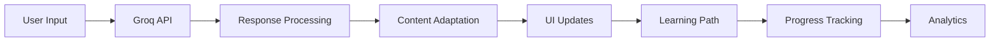
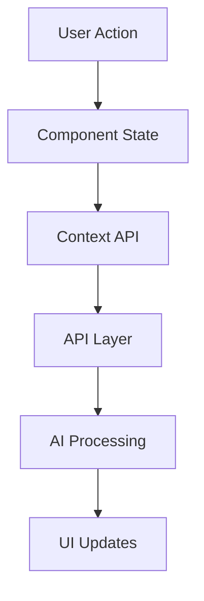
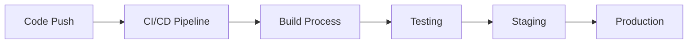

# SARA - Smart Adaptive Learning Roadmap Assistant


SARA is an intelligent educational platform that combines AI-powered adaptive learning with interactive course roadmaps to provide personalized learning experiences for students. Using advanced AI algorithms and interactive visualizations, SARA creates dynamic learning paths that adapt to each student's progress, understanding, and learning style.

[](https://opensource.org/licenses/MIT)
[](https://www.typescriptlang.org/)
[](https://reactjs.org/)
[](https://vitejs.dev/)

## 🌟 Key Features

### For Students 📚
- **AI-Powered Learning Paths**
  - Dynamic course progression based on performance
  - Real-time adaptation to learning style
  - Personalized content recommendations
  - Intelligent difficulty scaling

### For Educators 👨‍🏫
- **Comprehensive Analytics Dashboard**
  - Student progress tracking
  - Performance metrics visualization
  - Learning pattern analysis
  - Intervention opportunity identification

### Technical Highlights 🛠
- **Advanced AI Integration**
  - Groq API for real-time AI processing
  - Natural language understanding
  - Predictive learning analytics
  - Adaptive content generation

## 📸 Screenshots & Interface Guide

### Student Dashboard

- Main student interface showing:
  - Course overview cards
  - Progress statistics
  - Recent activity feed
  - AI assistant quick access
  - Upcoming deadlines
  - Course recommendations

### Interactive Learning Roadmap

- Dynamic course progression visualization:
  - Node-based learning path
  - Color-coded status indicators
  - Progress tracking
  - AI-adapted difficulty levels
  - Resource recommendations

### Course View Interface

- Comprehensive course management:
  - Course materials and resources
  - Progress tracking
  - Assignment submissions
  - Discussion forums
  - Interactive content

### Assessment Interface

- Advanced assessment features:
  - AI-powered question generation
  - Real-time feedback
  - Performance analytics
  - Adaptive difficulty

### Professor Dashboard

- Complete teaching management:
  - Student progress monitoring
  - Course analytics
  - Content management
  - Assessment tools


*Screenshot: Interactive Course Roadmap*

- **Smart Assessment System**
  - Automated skill level evaluation
  - Performance-based content adaptation
  - Comprehensive progress tracking
  - Instant feedback and recommendations

- **AI Learning Assistant**
  - Context-aware learning support
  - Real-time question answering
  - Resource recommendations
  - Personalized learning tips

### 👨‍🏫 For Professors

- **Course Management Dashboard**
  - Student progress monitoring
  - Performance analytics
  - Content customization tools
  - Assessment management


*Screenshot: Professor Dashboard Interface*

## 🛠 Technical Architecture

### Frontend Technologies
```typescript
// Core Technologies
├── React 18.0 with TypeScript 5.2
├── Vite 5.0 for build optimization
├── TailwindCSS for styling
└── shadcn/ui for component library

// Key Libraries
├── @xyflow/react        // Interactive roadmap visualization
├── groq                 // AI integration
├── react-router-dom     // Navigation
├── zod                  // Runtime type checking
└── sonner              // Toast notifications
```

### AI Integration Architecture


### Data Flow
```typescript
interface LearningPathNode {
  id: string;
  type: 'topic' | 'assessment' | 'milestone';
  data: {
    title: string;
    status: 'locked' | 'available' | 'completed';
    difficulty: number;
    adaptedContent: boolean;
  };
}
```

- **AI/ML Integration**
  - Groq API for AI processing
  - Custom ML models for learning path adaptation
  - Real-time content personalization

- **State Management & Routing**
  - React Context for state management
  - React Router for navigation
  - Custom hooks for business logic

## 🚀 Getting Started

## 🛠 Development Setup

### Prerequisites

#### Required Software
- Node.js 18 or higher
- Bun package manager (`curl -fsSL https://bun.sh/install | bash`)
- Git
- VS Code (recommended)

#### Environment Variables
Create a `.env` file in the root directory:
```env
VITE_GROQ_API_KEY=your_groq_api_key
VITE_OPENAI_API_KEY=your_openai_api_key  # Optional
VITE_API_BASE_URL=http://localhost:3000
VITE_ENV=development
```

#### VS Code Extensions
Essential extensions for optimal development:
```json
{
  "recommendations": [
    "dbaeumer.vscode-eslint",
    "esbenp.prettier-vscode",
    "bradlc.vscode-tailwindcss",
    "Vue.volar",
    "usernamehw.errorlens",
    "streetsidesoftware.code-spell-checker",
    "eamodio.gitlens",
    "christian-kohler.path-intellisense"
  ]
}
```

#### VS Code Settings
Recommended workspace settings:
```json
{
  "editor.formatOnSave": true,
  "editor.defaultFormatter": "esbenp.prettier-vscode",
  "editor.codeActionsOnSave": {
    "source.fixAll.eslint": true
  },
  "typescript.tsdk": "node_modules/typescript/lib"
}
```

### Project Setup

1. **Clone and Install**
```powershell
# Clone the repository
git clone https://github.com/yourusername/sara.git
cd sara

# Install dependencies
bun install

# Copy environment template
Copy-Item .env.example .env
```

2. **Configure Environment**
Edit `.env` with your API keys and configuration.

3. **Start Development Server**
```powershell
# Start the dev server
bun dev

# In a separate terminal, run type checking
bun type-check --watch
```

4. **Verify Installation**
- Open `http://localhost:5173` in your browser
- Confirm no TypeScript errors in VS Code
- Verify API connections in Network tab

### Project Structure

```typescript
src/
├── components/        // Reusable UI components
│   ├── assistant/    // AI chat interface components
│   ├── auth/         // Authentication components
│   ├── layout/       // Layout components
│   ├── professor/    // Professor-specific components
│   ├── student/      // Student-specific components
│   ├── theme/        // Theme components
│   └── ui/           // shadcn/ui components
│
├── context/          // React Context providers
│   ├── AuthContext.tsx
│   └── ThemeProvider.tsx
│
├── data/            // Mock data and constants
│   └── mockData.ts
│
├── hooks/           // Custom React hooks
│   └── use-mobile.tsx
│
├── lib/             // Utility functions
│   ├── groq.ts      // Groq API integration
│   └── utils.ts     // Helper functions
│
├── pages/           // Page components
│   ├── professor/
│   └── student/
│
└── types/           // TypeScript type definitions
    └── index.ts

```

### Development Workflow

1. **Branch Management**
```powershell
# Create feature branch
git checkout -b feature/your-feature-name

# Regular updates
git pull origin main
git merge main
```

2. **Code Quality**
```powershell
# Run type checking
bun type-check

# Run linting
bun lint

# Run tests
bun test

# Format code
bun format
```

3. **Building for Production**
```powershell
# Create production build
bun run build

# Preview production build
bun preview
```

## Project Structure

```
sara/
├── src/
│   ├── components/        # Reusable UI components
│   │   ├── assistant/    # AI chat interface components
│   │   ├── auth/        # Authentication components
│   │   ├── professor/   # Professor-specific components
│   │   ├── student/     # Student-specific components
│   │   └── ui/          # Base UI components
│   ├── context/         # React context providers
│   ├── data/           # Mock data and constants
│   ├── hooks/          # Custom React hooks
│   ├── lib/            # Utility functions and APIs
│   ├── pages/          # Page components
│   └── types/          # TypeScript type definitions
```

## Key Features Implementation

### Adaptive Learning Roadmap

The platform uses a sophisticated algorithm to generate personalized learning paths:

```typescript
interface RoadmapNodeData {
  title: string;
  description: string;
  status: 'locked' | 'available' | 'in_progress' | 'completed';
  difficulty: number;
  estimatedHours: number;
  prerequisites: string[];
  resources: Resource[];
  assessments: any[];
  curriculumWeek: number;
  learningObjectives: string[];
  adaptedContent: boolean;
}
```

### Assessment System

Comprehensive assessment system that evaluates:
- Topic proficiency
- Learning pace
- Difficulty adaptation
- Resource effectiveness

## Contributing

We welcome contributions! Please see our [Contributing Guidelines](CONTRIBUTING.md) for details on how to submit pull requests, report issues, and contribute to the project.

## License

This project is licensed under the MIT License - see the [LICENSE](LICENSE) file for details.

## Acknowledgments

- shadcn/ui for the beautiful component library
- React Flow for the interactive graph visualization
- Groq for AI capabilities
- All contributors who have helped shape this project

## Support

For support, please open an issue in the GitHub repository or contact our support team at support@sara-learning.com.

---
### 4. Course View Interface (`course-view.png`)
- **Size**: 1920x1080px
- **Key Elements**:
  - Course header with cover image
  - Tab navigation:
    - Overview
    - Resources
    - Assignments
    - Discussions
  - Progress cards
  - Resource listings
  - Instructor information
- **State**: Show the overview tab with some progress

### 5. Assessment Interface (`assessment.png`)
- **Size**: 1920x1080px
- **Key Elements**:
  - Question display
  - Multiple choice options
  - Progress indicator
  - Timer
  - Navigation controls
- **State**: Mid-assessment with some questions answered

### 6. Professor Dashboard (`professor-dashboard.png`)
- **Size**: 1920x1080px
- **Key Elements**:
  - Class overview statistics
  - Student performance metrics
  - Course management tools
  - Assessment creation interface
  - Analytics graphs
- **State**: Show active class data and analytics

## Screenshot Guidelines

### Technical Requirements
1. **Resolution**: Minimum 1920x1080px (4K preferred)
2. **Format**: PNG with transparency where applicable
3. **DPI**: 144 minimum
4. **Color Profile**: sRGB

### Visual Style Guidelines
1. **Theme**:
   - Capture in both light and dark modes
   - Use system theme that matches documentation
   - Ensure consistent styling across all screenshots

2. **Content**:
   - Use realistic but anonymized data
   - Show varied states and interactions
   - Include hover/active states where relevant

3. **Composition**:
   - Follow the Rule of Thirds
   - Ensure clear hierarchy
   - Highlight key features
   - Maintain consistent zoom level (100%)

4. **Quality Checklist**:
   - [ ] No personal/sensitive information
   - [ ] Clear, crisp text
   - [ ] Proper contrast
   - [ ] Consistent padding
   - [ ] No overlapping elements
   - [ ] No browser UI elements
   - [ ] No cursor visible unless demonstrating interaction

### Capture Process

1. **Preparation**:
   ```bash
   # Create screenshots directory if it doesn't exist
   New-Item -ItemType Directory -Force -Path "docs/images"
   ```

2. **Browser Setup**:
   - Use Chrome or Firefox in Developer Mode
   - Set viewport to exactly 1920x1080
   - Clear cache and reset zoom to 100%
   - Use clean profile without extensions

3. **Capture Tools**:
   - Windows: Snipping Tool or ShareX
   - macOS: Screenshot.app or CleanShot X
   - Cross-platform: LightShot or Screely

4. **Post-Processing**:
   - Optimize images using TinyPNG
   - Maintain aspect ratios
   - Add drop shadows if needed (8px blur, 25% opacity)
   - Compress without visible quality loss

### File Naming Convention

```
sara-[interface]-[variant]-[theme].[ext]
```

Examples:
- sara-dashboard-main-light.png
- sara-roadmap-active-dark.png
- sara-assessment-quiz-light.png

### Organization

Final screenshot structure:
```
docs/
└── images/
    ├── banner.png
    ├── dashboard/
    │   ├── light/
    │   └── dark/
    ├── roadmap/
    │   ├── light/
    │   └── dark/
    ├── course-view/
    │   ├── light/
    │   └── dark/
    ├── assessment/
    │   ├── light/
    │   └── dark/
    └── professor/
        ├── light/
        └── dark/
```

### Maintenance

1. **Version Control**:
   - Keep original PSDs/Sketch files
   - Include screenshot metadata
   - Document any special requirements

2. **Update Process**:
   - Review screenshots quarterly
   - Update when UI changes
   - Maintain consistency across docs

3. **Quality Assurance**:
   - Peer review all screenshots
   - Verify across different displays
   - Test in documentation context

### Accessibility Considerations

1. **Contrast**:
   - Minimum contrast ratio: 4.5:1
   - Test with color blindness simulators
   - Verify readability at different sizes

2. **Text**:
   - Minimum font size: 12px
   - Clear typography
   - Proper spacing

3. **Alternative Text**:
   - Provide detailed alt text
   - Include captions
   - Describe key features

## Implementation Checklist

- [ ] Create directory structure
- [ ] Set up capture environment
- [ ] Prepare test data
- [ ] Capture base screenshots
- [ ] Process and optimize
- [ ] Add to documentation
- [ ] Peer review
- [ ] Update README.md
- [ ] Final validation

# SARA API Documentation

## Overview

SARA's API provides programmatic access to the platform's core functionality, enabling integration with external systems and custom implementations. This document outlines the available endpoints, authentication methods, and usage examples.

## Authentication

### Obtaining API Keys

1. Navigate to the SARA dashboard
2. Go to Settings > API Keys
3. Generate a new API key
4. Store the key securely

### Authentication Header

```typescript
headers: {
  'Authorization': 'Bearer your_api_key_here',
  'Content-Type': 'application/json'
}
```

## Core Endpoints

### Learning Path Management

#### Get Learning Path

```typescript
GET /api/v1/learning-path/{userId}

Response:
{
  nodes: LearningNode[];
  edges: LearningEdge[];
  metadata: {
    currentLevel: number;
    progress: number;
    nextMilestone: string;
  }
}
```

#### Update Progress

```typescript
POST /api/v1/learning-path/{userId}/progress
Body: {
  nodeId: string;
  status: 'completed' | 'in_progress';
  score?: number;
}
```

### Assessment System

#### Generate Assessment

```typescript
POST /api/v1/assessment/generate
Body: {
  topic: string;
  difficulty: number;
  questionCount: number;
}

Response: {
  id: string;
  questions: Question[];
  metadata: AssessmentMetadata;
}
```

#### Submit Assessment

```typescript
POST /api/v1/assessment/{assessmentId}/submit
Body: {
  answers: Answer[];
  timeSpent: number;
}

Response: {
  score: number;
  feedback: Feedback[];
  recommendations: Recommendation[];
}
```

### AI Assistant

#### Generate Response

```typescript
POST /api/v1/assistant/chat
Body: {
  message: string;
  context?: string;
  history?: Message[];
}

Response: {
  response: string;
  suggestions: string[];
  resources: Resource[];
}
```

## Data Types

### Learning Path Types

```typescript
interface LearningNode {
  id: string;
  type: 'topic' | 'assessment' | 'milestone';
  data: {
    title: string;
    description: string;
    status: 'locked' | 'available' | 'completed';
    difficulty: number;
    resources: Resource[];
  };
}

interface LearningEdge {
  id: string;
  source: string;
  target: string;
  type: 'prerequisite' | 'recommended';
}
```

### Assessment Types

```typescript
interface Question {
  id: string;
  type: QuestionType;
  content: string;
  options?: string[];
  correctAnswer: string | string[];
  explanation: string;
  difficulty: number;
}

interface Answer {
  questionId: string;
  response: string | string[];
  timeSpent: number;
}

interface Feedback {
  type: 'success' | 'error' | 'info';
  message: string;
  details?: string;
  resources?: Resource[];
}
```

## Error Handling

### Error Responses

```typescript
{
  error: {
    code: string;
    message: string;
    details?: any;
  }
}
```

### Common Error Codes

- `400` - Bad Request
- `401` - Unauthorized
- `403` - Forbidden
- `404` - Not Found
- `429` - Too Many Requests
- `500` - Internal Server Error

## Rate Limiting

- 100 requests per minute per API key
- Burst limit: 200 requests
- Headers:
  - `X-RateLimit-Limit`
  - `X-RateLimit-Remaining`
  - `X-RateLimit-Reset`

## Webhooks

### Available Events

- `learning.progress.updated`
- `assessment.completed`
- `milestone.achieved`
- `content.generated`

### Webhook Format

```typescript
{
  event: string;
  timestamp: string;
  data: {
    userId: string;
    eventData: any;
  };
  signature: string;
}
```

## Examples

### JavaScript/TypeScript

```typescript
const sara = new SARAClient('your_api_key');

// Get learning path
const path = await sara.getLearningPath(userId);

// Generate assessment
const assessment = await sara.generateAssessment({
  topic: 'JavaScript Basics',
  difficulty: 0.7,
  questionCount: 10
});

// Submit answers
const result = await sara.submitAssessment(assessmentId, {
  answers: [/* ... */],
  timeSpent: 600
});
```

### Python

```python
from sara_client import SARA

sara = SARA('your_api_key')

# Get learning path
path = sara.get_learning_path(user_id)

# Generate assessment
assessment = sara.generate_assessment(
    topic='JavaScript Basics',
    difficulty=0.7,
    question_count=10
)

# Submit answers
result = sara.submit_assessment(
    assessment_id,
    answers=[...],
    time_spent=600
)
```

## Best Practices

1. **Error Handling**
   - Implement proper error handling
   - Use exponential backoff for retries
   - Log all API interactions

2. **Rate Limiting**
   - Monitor rate limit headers
   - Implement request queuing
   - Use bulk operations where possible

3. **Security**
   - Store API keys securely
   - Use HTTPS for all requests
   - Validate webhook signatures

## SDKs and Tools

- [SARA TypeScript SDK](https://github.com/sara/typescript-sdk)
- [SARA Python Client](https://github.com/sara/python-client)
- [SARA CLI](https://github.com/sara/cli)
- [Postman Collection](https://www.postman.com/sara/workspace)

## Support

- Documentation: [docs.sara.dev](https://docs.sara.dev)
- Issues: [GitHub Issues](https://github.com/sara/sara/issues)
- Email: api-support@sara.dev

## Changelog

### v1.0.0 (2025-05-23)
- Initial API release
- Core endpoints implementation
- Webhook support
- Rate limiting

### v1.1.0 (Coming Soon)
- Bulk operations
- Advanced filtering
- Real-time updates
- Enhanced analytics


# SARA Platform Architecture

## Overview

SARA (Smart Adaptive Learning Roadmap Assistant) is built on a modern, scalable architecture that emphasizes modularity, type safety, and real-time adaptability. This document outlines the key architectural decisions and patterns used in the platform.

## Core Technologies

### Frontend Stack
- **React 18** - UI framework with concurrent features
- **TypeScript** - Static typing and enhanced developer experience
- **Vite** - Next-generation frontend tooling
- **TailwindCSS** - Utility-first CSS framework
- **shadcn/ui** - Accessible component system
- **React Flow** - Interactive node-based UI

### AI Integration
- **Groq API** - High-performance AI model integration
- **Custom ML Models** - Learning path adaptation
- **Vector Embeddings** - Content similarity matching

## Architecture Patterns

### Component Architecture

```typescript
components/
├── atomic/       // Atomic design pattern
│   ├── atoms/    // Basic building blocks
│   ├── molecules/
│   └── organisms/
├── functional/   // Pure functional components
└── stateful/     // Components with state management
```

### Data Flow



### State Management

1. **Local Component State**
   ```typescript
   interface ComponentState {
     isLoading: boolean;
     data: DataType | null;
     error: Error | null;
   }
   ```

2. **Global Context**
   ```typescript
   interface GlobalState {
     user: UserState;
     theme: ThemeState;
     settings: SettingsState;
   }
   ```

3. **AI State Management**
   ```typescript
   interface AIState {
     model: string;
     temperature: number;
     context: string[];
     history: Message[];
   }
   ```

## Key Features Implementation

### Adaptive Learning System

```typescript
interface AdaptiveLearning {
  getCurrentLevel(): number;
  assessProgress(score: number): void;
  adjustDifficulty(): void;
  recommendNextContent(): Content[];
}
```

### Real-time Progress Tracking

```typescript
interface ProgressTracker {
  trackEvent(event: LearningEvent): void;
  calculateProgress(): number;
  generateInsights(): LearningInsight[];
}
```

### AI-Powered Content Generation

```typescript
interface ContentGenerator {
  generateQuestion(topic: string): Promise<Question>;
  adaptContent(content: Content, level: number): Promise<Content>;
  createFeedback(response: StudentResponse): Promise<Feedback>;
}
```

## Security Considerations

1. **Authentication**
   - JWT-based auth
   - Refresh token rotation
   - Session management

2. **Data Protection**
   - End-to-end encryption
   - Data anonymization
   - GDPR compliance

3. **API Security**
   - Rate limiting
   - Request validation
   - CORS configuration

## Performance Optimizations

1. **Code Splitting**
   ```typescript
   const Component = React.lazy(() => import('./Component'));
   ```

2. **Caching Strategy**
   ```typescript
   interface CacheConfig {
     ttl: number;
     maxSize: number;
     invalidationRules: Rule[];
   }
   ```

3. **Resource Loading**
   - Image optimization
   - Lazy loading
   - Preloading critical assets

## Testing Strategy

1. **Unit Tests**
   ```typescript
   describe('Component', () => {
     it('should render correctly', () => {
       // Test implementation
     });
   });
   ```

2. **Integration Tests**
   - API integration
   - State management
   - User flows

3. **E2E Tests**
   - Critical path testing
   - User journey validation
   - Performance monitoring

## Deployment Architecture



## Monitoring and Analytics

1. **Performance Metrics**
   - Load times
   - Interaction delays
   - API response times

2. **User Analytics**
   - Learning patterns
   - Feature usage
   - Error rates

3. **AI Model Monitoring**
   - Accuracy metrics
   - Response times
   - Adaptation effectiveness

## Future Considerations

1. **Scalability**
   - Microservices architecture
   - Serverless functions
   - Edge computing

2. **AI Enhancements**
   - Multi-model integration
   - Real-time adaptation
   - Personalization improvements

3. **Platform Extensions**
   - Mobile applications
   - Offline support
   - API marketplace

## Contributing

See [CONTRIBUTING.md](../CONTRIBUTING.md) for detailed contribution guidelines.

## License

This project is licensed under the MIT License - see the [LICENSE](../LICENSE) file for details.

# 📸 SARA Screenshot Guide

This guide provides detailed instructions for capturing and preparing screenshots for the SARA platform documentation.

## Required Screenshots Overview

### 1. Platform Banner (`banner.png`)
- **Size**: 1920x480px
- **Content**: Branded header image with SARA logo and tagline
- **Style**: Dark theme with purple/blue gradient
- **Location**: Top of README.md

### 2. Student Dashboard (`dashboard.png`)
- **Size**: 1920x1080px
- **Key Elements**:
  - Course cards grid
  - Progress statistics
  - AI assistant widget
  - Recent activity feed
  - Navigation menu
  - Dark/light mode toggle
- **State**: Show multiple courses with varying progress levels

### 3. Interactive Learning Roadmap (`roadmap.png`)
- **Size**: 1920x1080px
- **Key Elements**:
  - Node-based learning path
  - Different node states:
    - Locked (gray)
    - Available (purple)
    - In Progress (blue)
    - Completed (green)
  - Side panel with node details
  - Progress indicators
- **State**: Display an active node with opened details panel

1. `dashboard.png`
   - Location: Main student dashboard
   - What to capture: Show the overall layout with the course progress cards, AI assistant button, and navigation
   - Recommended size: 1280x720px

2. `roadmap.png`
   - Location: Course roadmap view
   - What to capture: Interactive learning path with nodes showing different states (locked, available, in-progress, completed)
   - Include some hover states and the side panel showing node details
   - Recommended size: 1280x720px

3. `professor-dashboard.png`
   - Location: Professor's dashboard
   - What to capture: Analytics overview, student progress tracking, and course management interface
   - Recommended size: 1280x720px

## Screenshot Guidelines

1. Use a high-resolution display (minimum 1440p)
2. Set browser zoom to 100%
3. Use system dark/light theme that matches your documentation theme
4. Ensure no sensitive or personal information is visible
5. Include examples of various states and interactions
6. Use consistent window sizes across all screenshots

## Placeholder Images

Until you can take actual screenshots of the running application, you can use the following placeholder text in your markdown:

```markdown

*Screenshot coming soon: Brief description of what will be shown*
```


Built with ❤️ for better education
