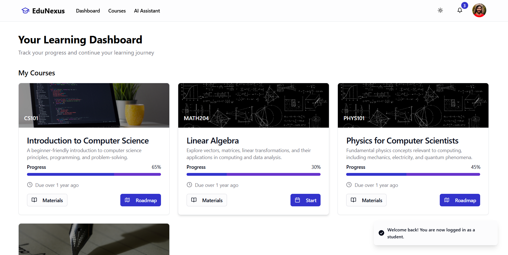
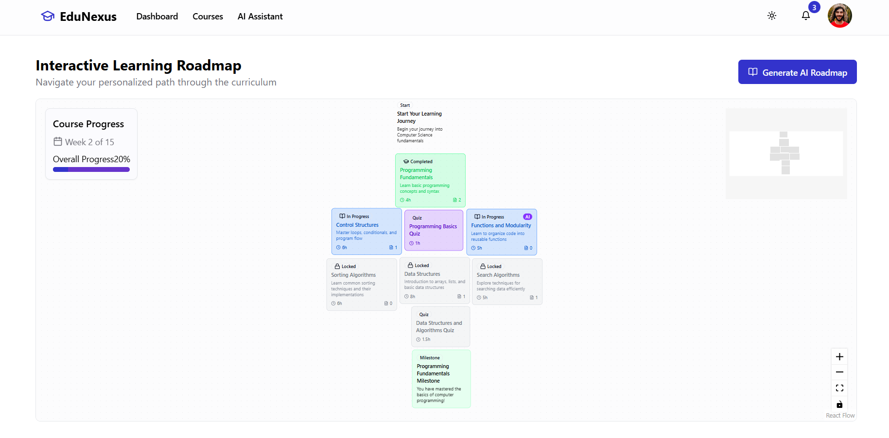
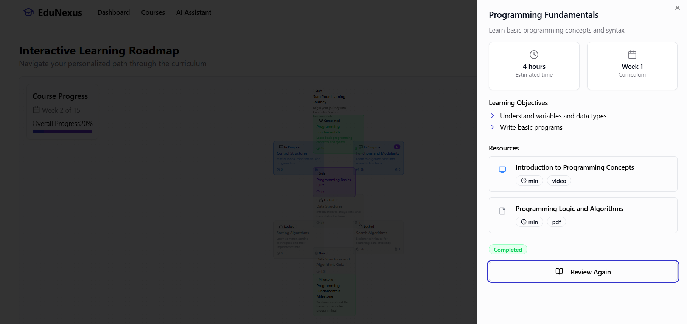
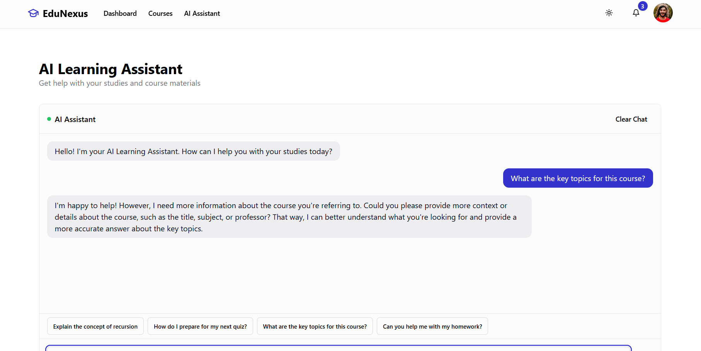

# AI-Driven Academic Success Platform

## 🎯 Core Purpose
SARA is an AI-powered educational platform that creates personalized learning experiences by adapting to each student's progress and learning style in real-time.

## 🌟 Core Features & Solutions

### 1. Adaptive Learning Roadmap
**Problem:** Traditional one-size-fits-all learning paths don't account for individual student needs.

**Solution:**
- Interactive visual learning paths that adjust in real-time
- AI-powered difficulty scaling based on performance

### 2. Smart Assessment System
**Problem:** Standard assessments don't provide meaningful feedback or adapt to student understanding.

**Solution:**
- Real-time performance evaluation
- Dynamic question difficulty adjustment
- Instant feedback with personalized explanations
- Progress tracking with detailed analytics
- AI-generated practice questions

### 3. Intelligent Course Assistant
**Problem:** Students often need immediate help outside of office hours.

**Solution:**
- 24/7 AI tutor availability
- Context-aware responses based on course material
- Real-time question answering
- Code explanation and debugging help

### 4. Professor Dashboard
**Problem:** Educators struggle to track individual student progress and identify intervention needs.

**Solution:**
- Real-time student progress monitoring
- Performance analytics and insights
- Early intervention indicators
- Content effectiveness metrics
- Automated progress reports

### 5. Resource Management
**Problem:** Finding relevant learning materials can be overwhelming.

**Solution:**
- AI-curated resource recommendations
- Smart content categorization
- Progress-based material suggestions
- Multi-format content support:
  -  Video lectures
  -  Interactive exercises
  -  Reading materials
  -  Practice problems

##  Tech Stack Highlights

### Frontend
- React 18 with TypeScript
- TailwindCSS & shadcn/ui
- React Flow for roadmap visualization
- React Query for state management

### AI Integration
- Groq API for AI processing
- Real-time content adaptation
- Natural language understanding

### User Experience
- Responsive design
- Dark/light mode
- Accessible components
- Real-time updates

## Interface Preview

### Student Dashboard

- Course overview
- Progress tracking
- AI assistant access
- Upcoming deadlines

### Learning Roadmap

- Interactive course progression
- Visual learning path
- Progress indicators
- Resource access

### Assessment Interface

- Smart quiz system
- Real-time feedback
- Performance tracking
- AI-assisted help
